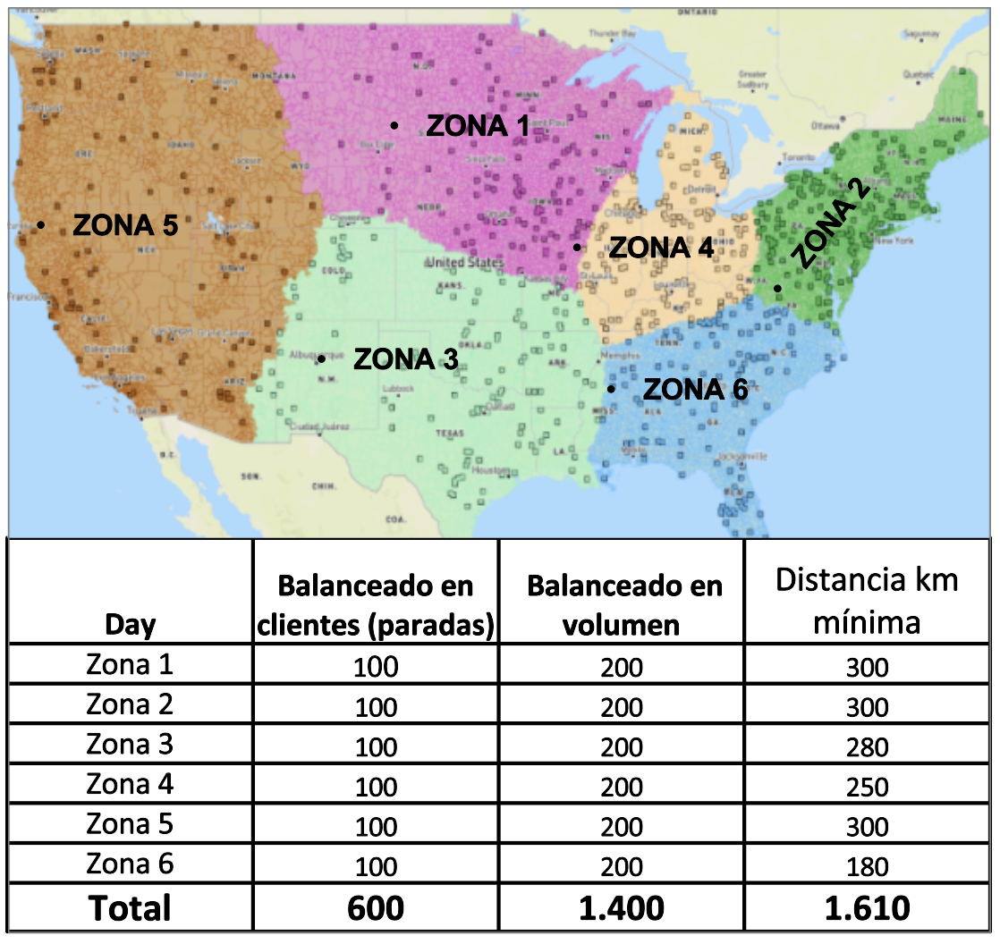
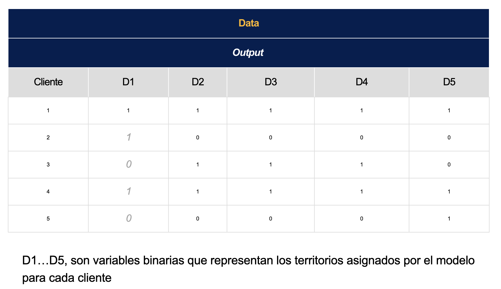

# Reto México

En AB InBev queremos encontrar territorios óptimos de distribución de nuestros productos, donde cada zona o territorio  será un día especifico de entrega que concentrará  toda la capacidad logística disponible, provocando una  reducción de kilómetros recorridos, mejorando los tiempos de entrega y potencializando los niveles de servicio.

## ¿Qué construir?

El objetivo es  dividir  un centro de distribución en 6 territorios óptimos, donde cada territorio debe garantizar que la distancia recorrida sea mínima , que no se exceda la capacidad de reparto por día (Zonas balanceadas por volumen), Los territorios deben estar en función de la frecuencia de visita al cliente, Todos los territorios deben tener una misma cantidad de clientes (Zonas balanceadas por número de paradas).

Para esto deberás crear Un modelo de optimización para encontrar territorios de reparto donde:  la distancia recorrida sea mínima, el reparto sea viable con la capacidad logística actual, y el número de clientes por territorio sea exactamente el mismo garantizando la mejora de los niveles de servicio. ​

## ¿Qué enviar?

1. El output requerido completo.csv​
2. Código completo de la construcción de la solución (únicamente R o Python – no evaluaremos códigos en software comerciales).link de github​
3. Una presentación a detalle de la metodología usada para resolver el problema, el modelo aplicado,  consideraciones y resultados obtenidos. (Máximo 5 diapositivas).​

